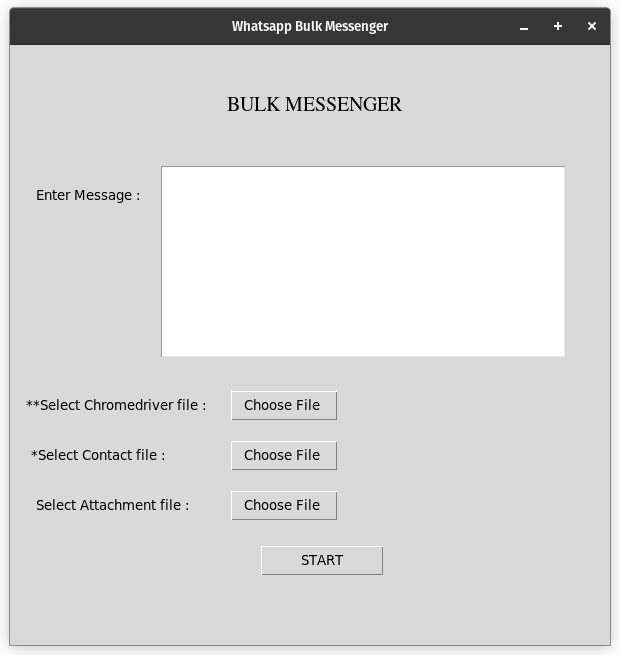

# _**Whatsapp_Bulk_Messenger**_

## **GUI**


## **Features**

- Login once and use forever
  - want to messege from new user ? delete ```User_Data``` directory 
   
- Can send attachments
- Can send multiple line messages

## Installation

> Install ```requirements.txt```

```pip install -r requirements.txt```

> run ```main.py``` file

```python3 main.py```

## How to use

- "Enter Message" - Type the message you want to send 

- "Select Chromedriver file" - select the correct Chromedriver file (**Compulsary**)

- "Select Contact file" - select the contact file which have the list of contacts that you want to send messages (**Compulsary**)

    - The Contact file should be in either .csv or .xlsx format
    
    - The column name of the list of contact numbers should be "Contact". For Example refer ```phone_number.csv```
   
-  "Select Attachment file" - if you want to attach any documents or file along with the text message then you can attach the file here (**Optional**)

- "Start" - Starts the Bot


Thank You
